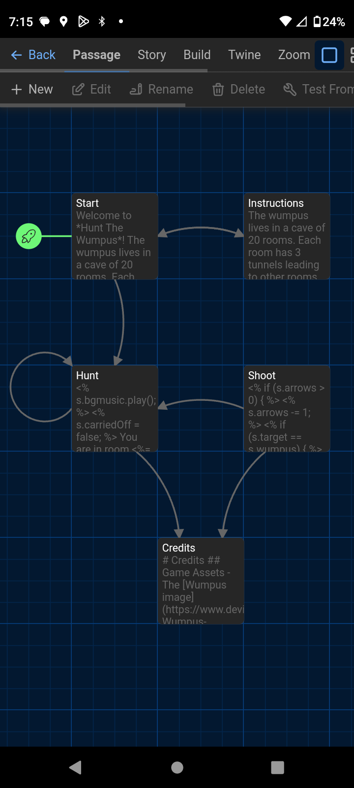

# Twine Mobile

This repository is a fork of [Twine 2.9.2](http://twinery.org/2). The only difference is a few added stylesheet rules to make the toolbars single row and scrollable, in order to make it usable on a smaller screen.

You can access Twine Mobile by going to <https://www.minewyrtruman.com/twine-mobile/#/>.

Here's the CSS rules that I added: 

```css
@media only screen and (max-width:600px) {

	.button-bar,
	.react-tabs__tab-panel--selected .button-bar.orientation-horizontal,
	.route-toolbar-top {
		display: flex;
		flex-direction: row;
		flex-wrap: nowrap;
		overflow-x: scroll;
		overflow-y: clip
	}

	.button-bar button {
		width: fit-content;
		text-wrap: nowrap
	}

	.storage-quota {
		display: none
	}
}
```

## Special Thanks

Without the following people from the Twine Discord server, I'd have never figured out the code for the CSS rules added above.

- [sjoerdhekking](https://writtenhorror.com/)
- [hituro](https://www.teuton.org/~stranger/)
- [maliface](https://github.com/MalifaciousGames)

## Install to Device

Like Twine itself, Twine Mobile is a Progressive Web App (PWA). This means it can be installed to your device through your web browser. The major advantage of doing this would be that you will have more screen real estate to work with, since there won't be the address bar at the top. 

The process for doing so may vary by device and browser. Google would be your best bet on figuring out how to do so if you don't know how to.

## Screenshot

